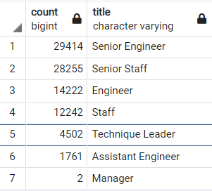

# Pewlett-Hackard-Analysis

# Overview of the Analysis
The Analysis was performed to assist Bobby in find the the number of employees retiring at Pewlett Hackard, and help the company to gain an insight on how to prepare these roles once the employees retire. 

The main purpose of the analysis is to
  1. Determine the number of retiring employees per title in the company.
  2. Identify the employees whom are eligible to participate in the company's mentorship program.

# Results

## Points
1. 41,000+ opening spots in the company

2. The opening spots count for over 40% of the company's workforce

3. Management positions are heavily impacted 

4. It is necessary for the HR team to fill in the missing positions as early as possible

- As we can see from the previous chart, there are going to be over 41,000 sports open once the employees retire in the company. This would potentially be a problem for the company, as the company would need its    HR team's best effort to fill in those spots and keep the management structure.  

# Summary

